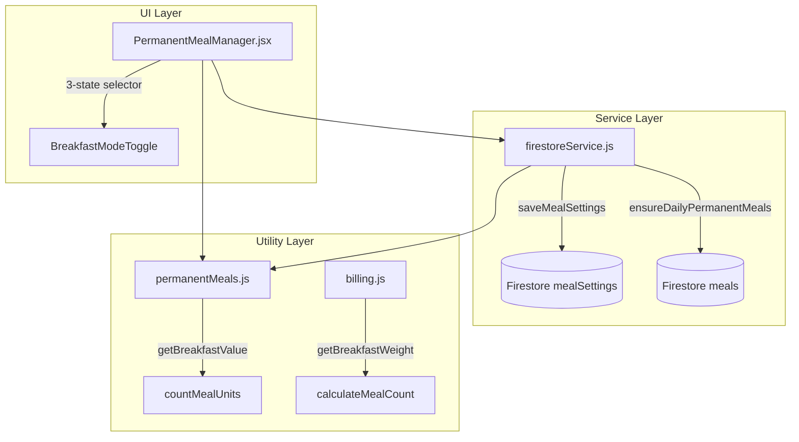
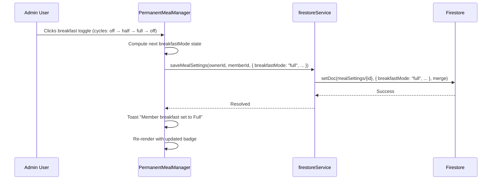
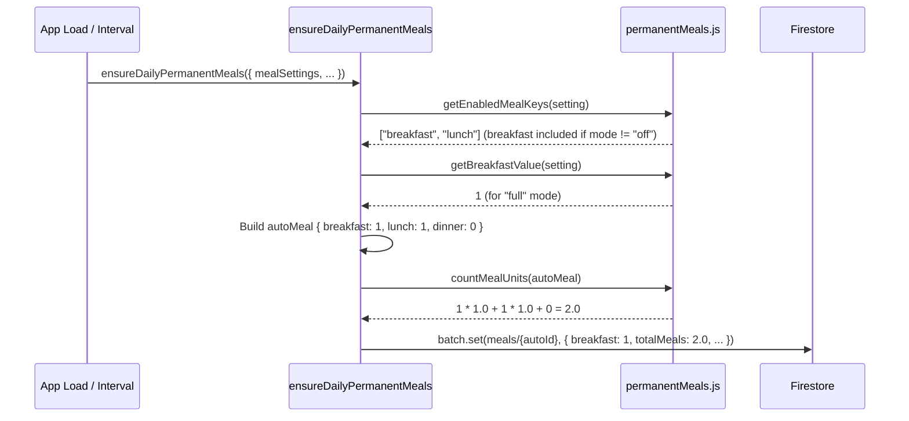

# Design Document: Breakfast Mode Selector

## Overview

This feature upgrades the Permanent Meal System's breakfast control from a simple boolean toggle (on/off mapping to 0.5 meal units) to a 3-state selector supporting Off (0 units), Half Breakfast (0.5 units), and Full Breakfast (1.0 units). The change affects only the permanent meal configuration, auto-generation logic, and unit calculations — lunch and dinner remain as boolean toggles.

The motivation is to give mess members flexibility in how breakfast is counted toward their meal totals and billing. A "full breakfast" costs double the current half-breakfast rate, reflecting real-world scenarios where some members eat a larger morning meal.

Backward compatibility is maintained by treating existing `breakfast: true` documents as "half" mode and `breakfast: false` as "off", while new writes use a `breakfastMode` field with explicit string values.

## Architecture



## Sequence Diagrams

### Setting Breakfast Mode



### Auto-Meal Generation with Breakfast Mode



## Components and Interfaces

### Component 1: BreakfastModeToggle (New)

**Purpose**: A 3-state cycling button that replaces the binary Check/X toggle for breakfast only.

**Interface**:
```javascript
// Props
{
  mode: "off" | "half" | "full",  // current breakfast mode
  disabled: boolean,               // true when saving or non-admin
  memberName: string,              // for aria-label
  onCycle: (nextMode: string) => void  // callback with next mode value
}
```

**Responsibilities**:
- Render visual state: Off (X icon, muted), Half (half-circle icon, orange), Full (check icon, orange-bright)
- Cycle through states on click: off → half → full → off
- Provide accessible aria-label describing current state
- Animate transitions with framer-motion whileTap

### Component 2: PermanentMealManager (Modified)

**Purpose**: Existing component updated to use BreakfastModeToggle for breakfast column.

**Interface changes**:
```javascript
// toggleMemberMeal signature changes for breakfast:
// Before: toggleMemberMeal(member, "breakfast") → flips boolean
// After:  cycleBreakfastMode(member) → cycles "off" → "half" → "full" → "off"

// setAllForMeal changes for breakfast:
// Before: setAllForMeal("breakfast", true/false)
// After:  setAllBreakfast(mode) where mode is "off" | "half" | "full"
```

**Responsibilities**:
- Detect breakfast column and render BreakfastModeToggle instead of binary toggle
- Keep lunch/dinner as existing binary toggles
- Update bulk actions for breakfast to set a specific mode

### Component 3: permanentMeals.js (Modified Utilities)

**Purpose**: Core utility functions updated to handle 3-state breakfast.

**Interface**:
```javascript
// New constants
export const BREAKFAST_MODES = { OFF: "off", HALF: "half", FULL: "full" };
export const BREAKFAST_VALUES = { off: 0, half: 0.5, full: 1.0 };

// New function
export function getBreakfastMode(setting) → "off" | "half" | "full"

// New function
export function getBreakfastValue(setting) → 0 | 0.5 | 1.0

// Modified function
export function getEnabledMealKeys(setting) → string[]
// Now includes "breakfast" if breakfastMode !== "off" (or legacy breakfast: true)

// Modified function
export function countMealUnits(meal, mealSetting?) → number
// Uses getBreakfastValue when mealSetting provided, else falls back to * 0.5
```

## Data Models

### MealSetting Document (Firestore: mealSettings collection)

```javascript
// New schema
{
  id: string,              // document ID
  ownerId: string,         // mess owner
  memberId: string,        // member reference
  breakfastMode: "off" | "half" | "full",  // NEW FIELD
  breakfast: boolean,      // DEPRECATED - kept for backward compat reads
  lunch: boolean,          // unchanged
  dinner: boolean,         // unchanged
  updatedAt: Timestamp,
  updatedBy: string
}
```

**Migration/Compatibility Rules**:
- Read: If `breakfastMode` is undefined, derive from `breakfast` boolean: `true` → "half", `false` → "off"
- Write: Always write both `breakfastMode` (new) AND `breakfast` (legacy) for backward compat
  - "off" → `breakfast: false`
  - "half" → `breakfast: true`
  - "full" → `breakfast: true` (legacy field just means "enabled")

### Auto-Generated Meal Document (Firestore: meals collection)

```javascript
// Existing schema - breakfast field changes meaning
{
  id: string,              // auto_{ownerId}_{memberId}_{date}
  ownerId: string,
  memberId: string,
  date: string,            // "YYYY-MM-DD"
  breakfast: number,       // NOW: 0, 0.5, or 1 (was: 0 or 1)
  lunch: number,           // 0 or 1
  dinner: number,          // 0 or 1
  totalMeals: number,      // recalculated with new breakfast weight
  autoGenerated: boolean,
  source: "permanent-auto",
  manualOverride: boolean,
  autoGeneratedAt: Timestamp,
  updatedAt: Timestamp
}
```

**Validation Rules**:
- `breakfastMode` must be one of: "off", "half", "full"
- `breakfast` field in meals must be >= 0 and <= 1
- `totalMeals` must equal: breakfast_value × breakfast_weight + lunch + dinner

## Algorithmic Pseudocode

### Breakfast Mode Resolution Algorithm

```javascript
/**
 * ALGORITHM: resolveBreakfastMode
 * INPUT: setting (mealSetting document from Firestore)
 * OUTPUT: "off" | "half" | "full"
 *
 * Handles backward compatibility with legacy boolean field.
 */
function resolveBreakfastMode(setting) {
  // New field takes priority
  if (setting.breakfastMode !== undefined) {
    return setting.breakfastMode; // "off" | "half" | "full"
  }
  // Legacy fallback
  if (setting.breakfast === true) {
    return "half";
  }
  return "off";
}
```

**Preconditions:**
- `setting` is a valid object (may be empty/partial)

**Postconditions:**
- Returns exactly one of: "off", "half", "full"
- If `breakfastMode` field exists, it is returned directly
- If only legacy `breakfast` boolean exists, maps true→"half", false→"off"

### Breakfast Value Mapping Algorithm

```javascript
/**
 * ALGORITHM: getBreakfastValue
 * INPUT: setting (mealSetting document)
 * OUTPUT: numeric meal unit value (0, 0.5, or 1.0)
 */
function getBreakfastValue(setting) {
  const mode = resolveBreakfastMode(setting);
  const VALUES = { off: 0, half: 0.5, full: 1.0 };
  return VALUES[mode];
}
```

**Preconditions:**
- `setting` is a valid mealSetting object

**Postconditions:**
- Returns 0 when mode is "off"
- Returns 0.5 when mode is "half"
- Returns 1.0 when mode is "full"
- Never returns any other value

### Mode Cycling Algorithm

```javascript
/**
 * ALGORITHM: getNextBreakfastMode
 * INPUT: currentMode ("off" | "half" | "full")
 * OUTPUT: next mode in cycle
 *
 * Cycle: off → half → full → off
 */
function getNextBreakfastMode(currentMode) {
  const CYCLE = { off: "half", half: "full", full: "off" };
  return CYCLE[currentMode] || "half"; // default to "half" for unknown
}
```

**Preconditions:**
- `currentMode` is a string

**Postconditions:**
- "off" → "half", "half" → "full", "full" → "off"
- Unknown values default to "half" (safe fallback)

**Loop Invariants:** N/A (no loops)

### Updated countMealUnits Algorithm

```javascript
/**
 * ALGORITHM: countMealUnits (updated)
 * INPUT: meal (meal document with breakfast/lunch/dinner numbers)
 * OUTPUT: total meal units as a number
 *
 * CHANGE: breakfast field now stores 0, 0.5, or 1 directly.
 * The multiplication by 0.5 is removed — the value IS the unit count.
 */
function countMealUnits(meal = {}) {
  // For auto-generated meals, breakfast already contains the unit value
  // For backward compat with old meals where breakfast was 0 or 1:
  const breakfastRaw = Number(meal.breakfast || 0);
  const breakfastUnits = breakfastRaw <= 1
    ? breakfastRaw * 0.5  // Legacy: 0 or 1 → 0 or 0.5
    : breakfastRaw;       // Should not happen, but safe

  // ALTERNATIVE APPROACH (chosen): Store the actual value in breakfast field
  // New auto-meals write breakfast as 0, 0.5, or 1.0 directly
  // So we need a way to distinguish old vs new meals.
  // DECISION: Keep multiplier at 0.5, but write breakfast=2 for "full" mode
  // OR: Change breakfast field to store the unit value directly (0, 0.5, 1.0)
  // CHOSEN: Write breakfast value as the raw count (0, 1, or 2) and keep * 0.5
  
  return (
    Number(meal.breakfast || 0) * 0.5 +
    Number(meal.lunch || 0) +
    Number(meal.dinner || 0)
  );
}
```

**DESIGN DECISION**: To maintain backward compatibility with the existing `* 0.5` multiplier used across the codebase (billing.js, smartInsights.js, MealsPage.jsx), the breakfast field in meal documents will store:
- `0` for Off mode (0 × 0.5 = 0 units)
- `1` for Half mode (1 × 0.5 = 0.5 units) — same as current behavior
- `2` for Full mode (2 × 0.5 = 1.0 units)

This means **no changes needed** to `countMealUnits`, `calculateMealCount`, `billing.js`, or `smartInsights.js`.

### Auto-Meal Generation (Updated)

```javascript
/**
 * ALGORITHM: buildAutoMealForMember (within ensureDailyPermanentMeals)
 * INPUT: setting (mealSetting), skipped (skip map for today)
 * OUTPUT: autoMeal object { breakfast, lunch, dinner }
 */
function buildAutoMealForMember(setting, skipped, existingAuto) {
  const autoMeal = {
    breakfast: Number(existingAuto?.breakfast || 0),
    lunch: Number(existingAuto?.lunch || 0),
    dinner: Number(existingAuto?.dinner || 0),
  };

  const mode = resolveBreakfastMode(setting);

  // Breakfast handling
  if (mode !== "off" && !skipped.breakfast) {
    // Map mode to raw value: "half" → 1, "full" → 2
    const BREAKFAST_RAW = { half: 1, full: 2 };
    autoMeal.breakfast = BREAKFAST_RAW[mode];
  }

  // Lunch/Dinner unchanged (boolean → 0 or 1)
  if (setting.lunch && !skipped.lunch) {
    autoMeal.lunch = 1;
  }
  if (setting.dinner && !skipped.dinner) {
    autoMeal.dinner = 1;
  }

  return autoMeal;
}
```

**Preconditions:**
- `setting` is a valid mealSetting with breakfastMode or legacy breakfast field
- `skipped` is an object with boolean flags per meal key
- `existingAuto` may be null/undefined

**Postconditions:**
- `autoMeal.breakfast` is 0, 1, or 2
- `autoMeal.lunch` is 0 or 1
- `autoMeal.dinner` is 0 or 1
- Skipped meals are not overwritten

## Key Functions with Formal Specifications

### Function: resolveBreakfastMode(setting)

```javascript
export function resolveBreakfastMode(setting = {}) {
  if (setting.breakfastMode && ["off", "half", "full"].includes(setting.breakfastMode)) {
    return setting.breakfastMode;
  }
  return setting.breakfast ? "half" : "off";
}
```

**Preconditions:**
- `setting` is an object (may be empty)

**Postconditions:**
- Return value ∈ {"off", "half", "full"}
- `setting.breakfastMode` defined and valid → returns `setting.breakfastMode`
- `setting.breakfastMode` undefined, `setting.breakfast === true` → returns "half"
- `setting.breakfastMode` undefined, `setting.breakfast === false` → returns "off"

### Function: getNextBreakfastMode(current)

```javascript
export function getNextBreakfastMode(current) {
  const CYCLE = { off: "half", half: "full", full: "off" };
  return CYCLE[current] || "half";
}
```

**Preconditions:**
- `current` is a string

**Postconditions:**
- Return value ∈ {"off", "half", "full"}
- Follows cycle: off → half → full → off

### Function: getBreakfastRawValue(mode)

```javascript
export function getBreakfastRawValue(mode) {
  const RAW = { off: 0, half: 1, full: 2 };
  return RAW[mode] ?? 0;
}
```

**Preconditions:**
- `mode` ∈ {"off", "half", "full"} or unknown

**Postconditions:**
- "off" → 0, "half" → 1, "full" → 2
- Unknown → 0 (safe default)
- Return value × 0.5 = actual meal units

### Function: getEnabledMealKeys(setting) — Modified

```javascript
export function getEnabledMealKeys(setting = {}) {
  const keys = [];
  const breakfastMode = resolveBreakfastMode(setting);
  if (breakfastMode !== "off") keys.push("breakfast");
  if (setting.lunch) keys.push("lunch");
  if (setting.dinner) keys.push("dinner");
  return keys;
}
```

**Preconditions:**
- `setting` is a valid mealSetting object

**Postconditions:**
- Returns array of enabled meal key strings
- "breakfast" included iff breakfastMode ≠ "off"
- "lunch" included iff setting.lunch is truthy
- "dinner" included iff setting.dinner is truthy

## Example Usage

```javascript
// Example 1: Reading breakfast mode from a setting
const setting = { breakfastMode: "full", lunch: true, dinner: false };
resolveBreakfastMode(setting); // → "full"
getBreakfastRawValue("full");  // → 2

// Example 2: Legacy setting without breakfastMode
const legacySetting = { breakfast: true, lunch: true, dinner: true };
resolveBreakfastMode(legacySetting); // → "half"
getBreakfastRawValue("half");        // → 1

// Example 3: Cycling through modes
getNextBreakfastMode("off");   // → "half"
getNextBreakfastMode("half");  // → "full"
getNextBreakfastMode("full");  // → "off"

// Example 4: Auto-generated meal with full breakfast
const autoMeal = { breakfast: 2, lunch: 1, dinner: 0 };
countMealUnits(autoMeal); // → 2*0.5 + 1 + 0 = 2.0

// Example 5: Saving updated setting
await saveMealSettings(ownerId, memberId, {
  breakfastMode: "full",
  breakfast: true,  // legacy compat
  lunch: true,
  dinner: false,
});

// Example 6: UI toggle cycle
const currentMode = resolveBreakfastMode(memberSetting);
const nextMode = getNextBreakfastMode(currentMode);
// Update Firestore with nextMode
```

## Correctness Properties

*A property is a characteristic or behavior that should hold true across all valid executions of a system — essentially, a formal statement about what the system should do. Properties serve as the bridge between human-readable specifications and machine-verifiable correctness guarantees.*

### Property 1: Mode Resolution Determinism

*For any* meal setting document (with or without a `breakfastMode` field), `resolveBreakfastMode` SHALL always return exactly one value from the set {"off", "half", "full"} — never undefined, null, or any other value.

**Validates: Requirements 3.1, 3.2, 3.3, 3.4**

### Property 2: Backward Compatibility Invariant

*For any* meal setting where `breakfastMode` is undefined, the resolved mode SHALL match the legacy boolean behavior: `breakfast: true` resolves to "half" and `breakfast: false` resolves to "off".

**Validates: Requirements 3.2, 3.3**

### Property 3: Cycle Completeness

*For any* valid mode in {"off", "half", "full"}, applying `getNextBreakfastMode` exactly three times SHALL return to the original mode.

**Validates: Requirements 1.1, 7.1, 7.3**

### Property 4: Unit Calculation Consistency

*For any* valid breakfast mode, `getBreakfastRawValue(mode) * 0.5` SHALL equal the expected meal units: 0 for "off", 0.5 for "half", and 1.0 for "full".

**Validates: Requirements 4.1, 4.3, 4.4**

### Property 5: Write-Read Round Trip

*For any* valid mode in {"off", "half", "full"}, writing a setting with `breakfastMode: mode` and then resolving it SHALL return the same mode value.

**Validates: Requirements 3.1, 3.5**

### Property 6: Lunch/Dinner Isolation

*For any* meal setting and any breakfast mode change, the enabled state of lunch and dinner in `getEnabledMealKeys` SHALL depend only on their own boolean fields, not on the breakfast mode value.

**Validates: Requirements 5.4, 6.1, 6.2, 6.3**

### Property 7: Total Meals Formula

*For any* meal document with breakfast ∈ {0, 1, 2}, lunch ∈ {0, 1}, and dinner ∈ {0, 1}, `countMealUnits(meal)` SHALL equal `meal.breakfast * 0.5 + meal.lunch + meal.dinner`.

**Validates: Requirements 4.2, 8.2**

## Error Handling

### Error Scenario 1: Invalid breakfastMode Value in Firestore

**Condition**: A document has `breakfastMode` set to an unexpected string (e.g., corrupted data)
**Response**: `resolveBreakfastMode` falls through to legacy `breakfast` boolean check
**Recovery**: Next save operation writes a valid `breakfastMode` value, self-healing the document

### Error Scenario 2: Network Failure During Mode Toggle

**Condition**: Firestore write fails when cycling breakfast mode
**Response**: Toast error "Permanent meal update failed", UI reverts to previous state (optimistic update rolled back)
**Recovery**: User can retry the toggle; no partial state since Firestore writes are atomic

### Error Scenario 3: Concurrent Edits

**Condition**: Two admins toggle the same member's breakfast mode simultaneously
**Response**: Last-write-wins (Firestore default merge behavior)
**Recovery**: Real-time listener updates both UIs to reflect final state

## Testing Strategy

### Unit Testing Approach

- Test `resolveBreakfastMode` with all combinations: new field present, legacy only, empty setting
- Test `getNextBreakfastMode` cycle for all 3 states plus unknown input
- Test `getBreakfastRawValue` mapping for all modes
- Test `getEnabledMealKeys` includes/excludes breakfast correctly
- Test `countMealUnits` with breakfast values 0, 1, and 2

### Property-Based Testing Approach

**Property Test Library**: fast-check

- **Cycle property**: For all modes m, `getNextBreakfastMode(getNextBreakfastMode(getNextBreakfastMode(m))) === m`
- **Unit range property**: For all valid settings, `getBreakfastRawValue(resolveBreakfastMode(s)) * 0.5` is in {0, 0.5, 1.0}
- **Backward compat property**: For all settings where `breakfastMode` is undefined, result matches legacy boolean behavior

### Integration Testing Approach

- Verify Firestore round-trip: write breakfastMode, read back, confirm resolution
- Verify auto-meal generation produces correct breakfast raw values per mode
- Verify billing calculations with mixed old/new meal documents

## Performance Considerations

- No additional Firestore reads required — `breakfastMode` is on the same mealSettings document already fetched
- The 3-state toggle adds no extra network calls vs the current binary toggle
- `resolveBreakfastMode` is O(1) with a single field check and fallback

## Security Considerations

- Firestore rules should validate `breakfastMode` is one of ["off", "half", "full"] on write
- Only admin users can modify mealSettings (existing rule, unchanged)
- No new authentication or authorization changes needed

## Dependencies

- No new external libraries required
- Existing dependencies used: framer-motion (animations), lucide-react (icons), react-hot-toast (notifications)
- New icon needed: A "half-filled" indicator for the half-breakfast state (can use existing Lucide icons like `ChevronsUp` or a custom SVG half-circle)
