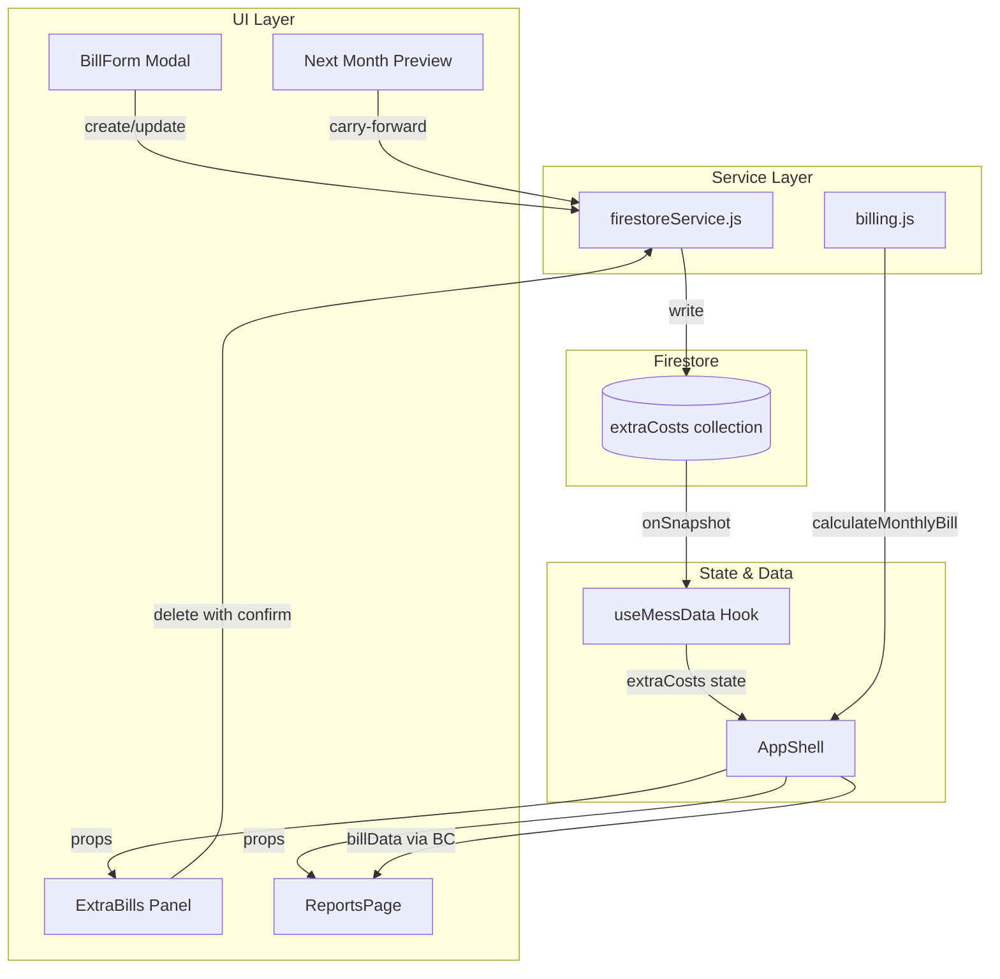

# Design Document: Extra Bills Billing Modes

## Overview

This design upgrades the existing Extra Bills system to support two billing modes — **Total Shared Bill** and **Per Member Unit Bill** — with member selection, category analytics, recurring bill management, member share transparency in reports, and safe delete protection.

Currently, the `extraCosts` collection stores simple documents with `ownerId`, `title`, `amount`, `date`, and `createdAt`. The `calculateMonthlyBill` function sums all extra cost amounts into a flat `totalExtra` value that is distributed equally across all members via the meal rate. This design introduces per-bill member targeting, dual calculation strategies, category tagging, recurrence metadata, and a richer billing calculator that computes individual member shares.

### Key Design Decisions

1. **No data migration** — Legacy documents without new fields are treated as `total_shared` mode with all active members selected. New fields are only written on create/edit.
2. **Client-side calculation** — Billing logic remains in `src/utils/billing.js` as a pure function. No Cloud Functions needed for bill computation.
3. **Firestore document schema extension** — The existing `extraCosts` collection gains new fields; no new collections are introduced.
4. **Real-time via existing onSnapshot** — The `useMessData` hook already subscribes to `extraCosts`; no subscription changes needed for basic real-time updates.
5. **Carry-forward is manual with preview** — Recurring bills are not auto-created by a cron. Instead, the admin sees a "Next Month Preview" and explicitly confirms carry-forward.

## Architecture



### Data Flow

1. Admin opens BillForm → selects billing mode, enters amount, selects members, picks category, toggles recurrence.
2. BillForm calls `addExtraCost` or `updateExtraCost` in firestoreService with the full document payload.
3. Firestore triggers onSnapshot → `useMessData` updates `extraCosts` state.
4. `AppShell` recalculates `billData` via `calculateMonthlyBill` with the updated `extraCosts` array.
5. ReportsPage and Dashboard receive updated `billData` with per-member extra bill shares.

## Components and Interfaces

### New/Modified Components

| Component | Location | Purpose |
|-----------|----------|---------|
| `BillForm` | `src/components/extra-bills/BillForm.jsx` | Modal form for creating/editing extra bills with billing mode, member selection, category, and recurrence |
| `ExtraBillsPanel` | `src/components/extra-bills/ExtraBillsPanel.jsx` | List view of extra bills with edit/delete actions, category grouping |
| `NextMonthPreview` | `src/components/extra-bills/NextMonthPreview.jsx` | Shows recurring bills that will carry forward, with disable action |
| `MemberSelector` | `src/components/extra-bills/MemberSelector.jsx` | Reusable checkbox list with select all/deselect all and count display |
| `DeleteConfirmModal` | `src/components/extra-bills/DeleteConfirmModal.jsx` | Enhanced confirmation modal with recurring bill warning |

### Modified Existing Files

| File | Changes |
|------|---------|
| `src/utils/billing.js` | Upgrade `calculateMonthlyBill` to compute per-member extra bill shares |
| `src/services/firestoreService.js` | Add `updateExtraCost`, enhance `addExtraCost` with full payload, add `carryForwardRecurringBills` |
| `src/pages/ReportsPage.jsx` | Add "Extra Bills" section with per-member share breakdown, category analytics |
| `src/pages/DashboardPage.jsx` | Add extra bills category summary widget |
| `src/components/AppShell.jsx` | Pass `extraCosts` and `members` to new ExtraBillsPanel route/section |
| `src/hooks/useMessData.js` | For member role: subscribe to extraCosts (needed for member share visibility) |

### Component Interfaces

```typescript
// BillForm Props
interface BillFormProps {
  open: boolean;
  onClose: () => void;
  ownerId: string;
  members: Member[];
  editBill?: ExtraBill | null;  // null = create mode
  userProfile: UserProfile;
}

// MemberSelector Props
interface MemberSelectorProps {
  members: Member[];
  selectedIds: string[];
  onChange: (ids: string[]) => void;
}

// ExtraBillsPanel Props
interface ExtraBillsPanelProps {
  extraCosts: ExtraBill[];
  members: Member[];
  ownerId: string;
  userProfile: UserProfile;
}

// DeleteConfirmModal Props
interface DeleteConfirmModalProps {
  open: boolean;
  onClose: () => void;
  onConfirm: () => void;
  billTitle: string;
  isRecurring: boolean;
}
```

## Data Models

### ExtraBill Document (Firestore `extraCosts` collection)

```typescript
interface ExtraBill {
  // Existing fields (preserved)
  id: string;              // Firestore document ID
  ownerId: string;         // Workspace owner ID
  title: string;           // Bill title (e.g., "Wifi - June")
  date: string;            // YYYY-MM-DD format
  createdAt: Timestamp;    // Firestore server timestamp

  // New fields
  billingMode: 'total_shared' | 'per_member_unit';  // Calculation strategy
  amount: number;          // Admin-entered value (total for shared, per-member for unit)
  totalAmount: number;     // Calculated total (= amount for shared, = amount * memberCount for unit)
  selectedMemberIds: string[];  // Array of member IDs included in this bill
  memberShare: number;     // Calculated per-member amount (= amount / memberCount for shared, = amount for unit)
  category: string;        // Lowercase: 'wifi' | 'electricity' | 'gas' | 'khala' | 'cleaning' | 'water' | 'maintenance' | 'other'
  isRecurring: boolean;    // Whether this bill repeats monthly
}
```

### Legacy Document Handling

Documents without `billingMode` are treated as:
```javascript
{
  billingMode: 'total_shared',
  totalAmount: amount,
  selectedMemberIds: activeMembers.map(m => m.id),
  memberShare: amount / activeMembers.length,
  category: 'other',
  isRecurring: false,
}
```

### Updated MemberBill Object (from `calculateMonthlyBill`)

```typescript
interface MemberBill {
  // Existing fields
  ...member,
  meals: number;
  deposit: number;
  mealCost: number;
  total: number;
  due: number;
  balance: number;
  mealRate: number;

  // New fields
  extraBillsTotal: number;        // Sum of all extra bill shares for this member
  extraBillsBreakdown: Array<{    // Individual bill details
    title: string;
    category: string;
    share: number;
    totalAmount: number;
    billingMode: string;
  }>;
}
```

### Calculation Logic

```javascript
// Total Shared Bill
memberShare = totalAmount / selectedMemberIds.length
// Round to 2 decimal places
memberShare = Math.round(memberShare * 100) / 100

// Per Member Unit Bill
totalAmount = amount * selectedMemberIds.length
memberShare = amount  // Each member pays the entered amount
```

### Updated `calculateMonthlyBill` Signature

```javascript
export function calculateMonthlyBill(
  members = [],
  meals = [],
  guestMeals = [],
  mealSettings = [],
  bazaar = [],
  deposits = [],
  extraCosts = []
) {
  // ... existing meal rate calculation stays the same
  // ... but member total now includes extraBillsTotal
  // total = mealCost + extraBillsTotal (bazaar is already in mealCost via meal rate)
}
```

**Important**: The current billing logic folds `totalExtra` into `grandExpense` which is then divided by total meals to get `mealRate`. The new design changes this: extra bills are **no longer** part of the meal rate calculation. Instead, each member's extra bill share is computed independently and added to their total. This gives accurate per-member billing based on actual selection rather than proportional meal consumption.

### Category Constants

```javascript
export const EXTRA_BILL_CATEGORIES = [
  { value: 'wifi', label: 'Wifi' },
  { value: 'electricity', label: 'Electricity' },
  { value: 'gas', label: 'Gas' },
  { value: 'khala', label: 'Khala' },
  { value: 'cleaning', label: 'Cleaning' },
  { value: 'water', label: 'Water' },
  { value: 'maintenance', label: 'Maintenance' },
  { value: 'other', label: 'Other' },
];
```


## Correctness Properties

*A property is a characteristic or behavior that should hold true across all valid executions of a system — essentially, a formal statement about what the system should do. Properties serve as the bridge between human-readable specifications and machine-verifiable correctness guarantees.*

### Property 1: Total Shared Bill division

*For any* positive amount and any non-empty set of selected members, when the billing mode is `total_shared`, the calculated `memberShare` SHALL equal `Math.round((amount / selectedMemberIds.length) * 100) / 100`, and `memberShare` SHALL have at most 2 decimal places.

**Validates: Requirements 3.1, 3.3, 3.4**

### Property 2: Per Member Unit Bill multiplication

*For any* positive amount and any non-empty set of selected members, when the billing mode is `per_member_unit`, the calculated `totalAmount` SHALL equal `amount * selectedMemberIds.length`, and `memberShare` SHALL equal the input `amount`.

**Validates: Requirements 4.1, 4.3**

### Property 3: Member inclusion/exclusion in billing

*For any* member and any set of extra bills, the member's `extraBillsTotal` SHALL equal the sum of `memberShare` values from only those bills where the member's ID appears in `selectedMemberIds`. Bills where the member is not in `selectedMemberIds` SHALL contribute zero to that member's total.

**Validates: Requirements 7.1, 7.2, 15.4, 15.5**

### Property 4: Legacy document backward compatibility

*For any* extra bill document that lacks a `billingMode` field, the billing calculator SHALL treat it as `total_shared` mode and distribute its `amount` equally among all active members, producing the same per-member share as `amount / activeMembers.length`.

**Validates: Requirements 12.1, 12.2**

### Property 5: Category grouping correctness

*For any* set of extra bills with various categories, grouping by category SHALL produce subtotals where each category's subtotal equals the sum of `totalAmount` for all bills in that category, and the sum of all category subtotals SHALL equal the sum of all bill `totalAmount` values.

**Validates: Requirements 14.3**

### Property 6: Final total composition

*For any* member bill computed by the billing calculator, the member's `total` (final due before deposits) SHALL equal `mealCost + extraBillsTotal`, where `mealCost` is derived from meal consumption × meal rate, and `extraBillsTotal` is the sum of their extra bill shares.

**Validates: Requirements 15.3**

### Property 7: Input validation rejects invalid data

*For any* amount that is zero, negative, or NaN, the validation function SHALL reject it. *For any* title that is an empty string or composed entirely of whitespace, the validation function SHALL reject it. *For any* positive amount and non-empty trimmed title, validation SHALL accept.

**Validates: Requirements 5.2, 5.3**

## Error Handling

### Form Validation Errors

| Condition | Error Message | Behavior |
|-----------|--------------|----------|
| Empty title | "Bill title is required" | Prevent submission, highlight field |
| Zero/negative amount | "Amount must be a positive number" | Prevent submission, highlight field |
| No members selected | "At least one member must be selected" | Prevent submission, show inline error |
| Invalid amount (NaN) | "Please enter a valid number" | Prevent submission, highlight field |

### Firestore Operation Errors

| Operation | Error Handling |
|-----------|---------------|
| Create fails | `toast.error("Failed to save extra bill: {reason}")`, form remains open with data preserved |
| Update fails | `toast.error("Failed to update extra bill: {reason}")`, form remains open |
| Delete fails | `toast.error("Failed to delete extra bill: {reason}")`, bill remains unchanged |
| Carry-forward fails | `toast.error("Failed to carry forward bill: {reason}")`, preview remains unchanged |

### Edge Cases

- **Division by zero**: If `selectedMemberIds` is empty (should be prevented by validation), the calculator returns `memberShare: 0` and `totalAmount: 0` as a safety fallback.
- **Member removed from system**: If a member ID in `selectedMemberIds` no longer exists in the members list, that member is silently excluded from the calculation (they won't appear in `memberBills`).
- **Floating point precision**: All currency calculations use `Math.round(value * 100) / 100` to avoid floating point drift.
- **Legacy documents**: Documents without `billingMode`, `selectedMemberIds`, or `category` fields are normalized at read time in the calculator, not mutated in Firestore.

## Testing Strategy

### Unit Tests (Example-Based)

- BillForm renders correct labels for each billing mode
- BillForm defaults to "Total Shared Bill" mode and "Other" category
- BillForm populates all fields correctly in edit mode
- MemberSelector pre-selects all active members on create
- DeleteConfirmModal shows enhanced warning for recurring bills
- Access control: admin/manager see CRUD controls, member sees read-only
- Toast notifications on success/failure
- Category dropdown contains all predefined options

### Property-Based Tests

**Library**: [fast-check](https://github.com/dubzzz/fast-check) (JavaScript PBT library)

**Configuration**: Minimum 100 iterations per property test.

Each property test references its design document property:

1. **Feature: extra-bills-billing-modes, Property 1: Total Shared Bill division** — Generate random positive amounts (0.01–999999) and random non-empty member ID arrays (1–50 members), verify `memberShare = round(amount / count, 2)` and result has ≤2 decimal places.

2. **Feature: extra-bills-billing-modes, Property 2: Per Member Unit Bill multiplication** — Generate random positive amounts and random non-empty member ID arrays, verify `totalAmount = amount * count` and `memberShare = amount`.

3. **Feature: extra-bills-billing-modes, Property 3: Member inclusion/exclusion in billing** — Generate random members and random extra bills with varying `selectedMemberIds`, run `calculateMonthlyBill`, verify each member's `extraBillsTotal` only includes shares from bills they're selected in.

4. **Feature: extra-bills-billing-modes, Property 4: Legacy document backward compatibility** — Generate random extra bill documents without `billingMode` field, run through calculator with random active members, verify result matches `amount / activeMembers.length` per member.

5. **Feature: extra-bills-billing-modes, Property 5: Category grouping correctness** — Generate random sets of bills with random categories, group them, verify subtotals sum to overall total and each category subtotal is correct.

6. **Feature: extra-bills-billing-modes, Property 6: Final total composition** — Generate random complete billing scenarios (members, meals, bazaar, deposits, extra bills), run `calculateMonthlyBill`, verify each member's `total = mealCost + extraBillsTotal`.

7. **Feature: extra-bills-billing-modes, Property 7: Input validation rejects invalid data** — Generate random invalid amounts (≤0, NaN, Infinity) and invalid titles (empty, whitespace-only), verify rejection. Generate valid amounts and titles, verify acceptance.

### Integration Tests

- Firestore write/read round-trip for new extra bill documents
- Real-time subscription updates when bills are created/modified/deleted
- Carry-forward creates new documents with correct parameters
- Security rules enforce `canManageOps` for write operations

### Manual Testing

- Responsive layout verification across 320px–1920px viewports
- Glassmorphism theme consistency check
- PDF/CSV export includes extra bill data correctly
- Mobile scrollable member list behavior
